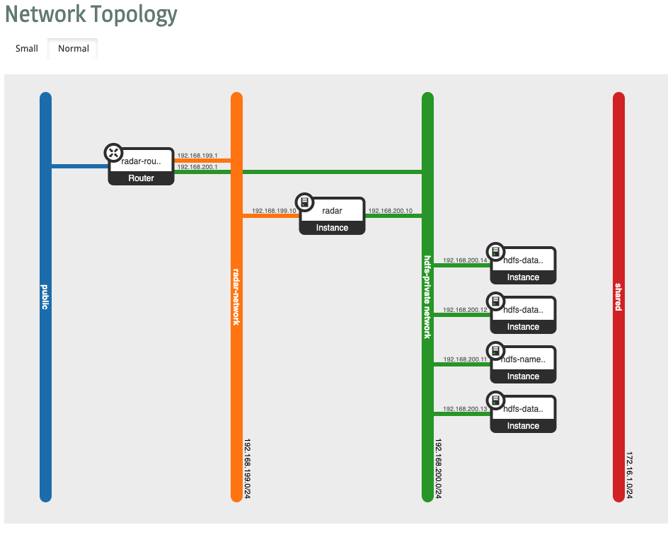

Deployment and Orchestration of the RADAR-base platform using Terraform

# Configurations
The Following Configurations to deploy are provided -

## Distributed HDFS
This configuration is provided with a distributed HDFS setup. 3 instances for datanodes and 1 instance for namenode.
And 1 large instance for all other RADAR components. The provided configuration is for resources on OpenStack but can be easily reciprocated for AWS and GCP.

The network topology is shown below -



Instance sizes can be easily changed by changing the respective instance resource blocks in `hdfs-vms.tf`.

### Usage

1. Set the OpenStack credentials and Auth details in the file `radar-openstack-terraform.tf`

```
provider "openstack" {
  user_name   = "your-user-name"
  tenant_name = "your-tenancy"
  password    = "you-password"
  auth_url    = "http://localhost:10000/v3"
  region      = "regionOne"
  project_domain_id  = "default"
}
```
2. Set the variables in `env.tfvars` according to your needs. Remember the TERRAFORM_OPENSTACK_RADAR_STATIC_IP should be on the TERRAFORM_OPENSTACK_RADAR_SUBNET and the TERRAFORM_OPENSTACK_HDFS_*_STATIC_IP should be on the TERRAFORM_OPENSTACK_HDFS_SUBNET

3. Set the variable in .env file for configuration of HDFS docker containers

4. Initialise terraform in the directory
    ```sh
      cd distributed-setup/hdfs
      terraform init
    ```
5. Run terraform plan to dry run your setup
    ```sh
      terraform plan
    ```
6. Apply the terraform plan
    ```sh
      terraform apply -var-file="env.tfvars"
    ```
